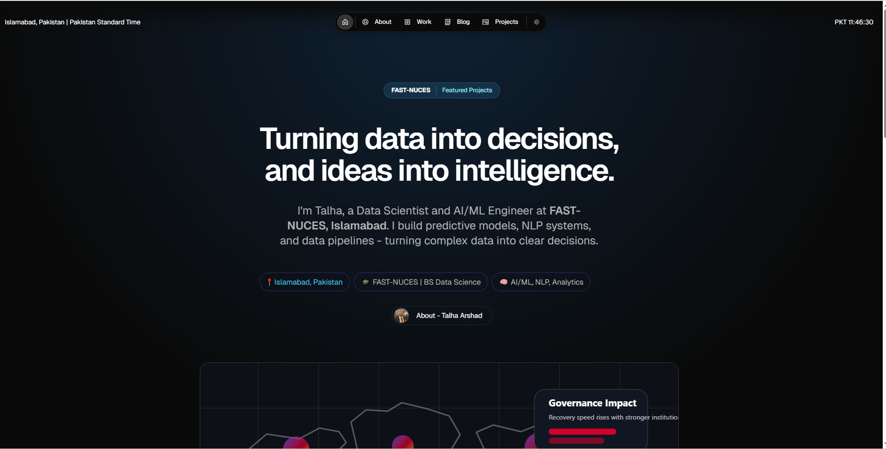

# Talha Arshad Portfolio

This repository contains the personal portfolio website of **Muhammad Talha Arshad**, a Data Scientist and AI/ML Engineer based in Islamabad, Pakistan. The site is built on top of the Magic Portfolio template and customized to present Talha's projects, featured work, technical background, and research profile in a cleaner and more personal format.

View the live demo here: [personal-portfolio-website-snowy-six.vercel.app/about](https://personal-portfolio-website-snowy-six.vercel.app/about)



## About

Talha is currently studying Data Science at **FAST-NUCES, Islamabad** and works across:

- Machine Learning and predictive modeling
- Natural Language Processing and multilingual AI systems
- Generative AI and diffusion-based workflows
- Data analytics, dashboards, and research-oriented experimentation
- Database-backed applications and software systems

The portfolio includes:

- A personalized homepage and About section
- Featured Work case studies written in MDX
- A Projects showcase with custom SVG previews
- A blog section for technical writing and project notes
- SEO, Open Graph metadata, and responsive layout support

## Tech Stack

This portfolio is built with:

- Next.js
- TypeScript
- Once UI
- MDX
- SCSS / CSS modules
- Vercel

## Getting Started

**1. Install dependencies**

```bash
npm install
```

**2. Start the development server**

```bash
npm run dev
```

**3. Open the site locally**

```text
http://localhost:3000
```

## Content Editing

Most personal content is centralized here:

```text
src/resources/content.tsx
```

Key portfolio areas:

- Homepage: `src/app/page.tsx`
- About page: `src/app/about/page.tsx`
- Projects page: `src/app/projects/page.tsx`
- Work case studies: `src/app/work/projects`
- Blog posts: `src/app/blog/posts`

To add a new featured work case study:

```text
Add a new .mdx file to src/app/work/projects
```

To add a new blog post:

```text
Add a new .mdx file to src/app/blog/posts
```

## Featured Skills

Talha's current skill set represented across the site includes:

- Python, R, C++, C#, Node.js
- SQL, MySQL, NoSQL
- Next.js, TypeScript, EJS
- Machine Learning, Deep Learning, NLP
- Generative AI, Stable Diffusion, Diffusers
- RAG systems, AI agents, workflow automation
- Tableau, ERD, Docker, Gradio
- Weights & Biases, Hugging Face Hub, GitHub, LaTeX

## Deployment

The site is deployment-ready for Vercel and currently live at:

[https://personal-portfolio-website-snowy-six.vercel.app/about](https://personal-portfolio-website-snowy-six.vercel.app/about)

## Credits

This project is customized from the original Magic Portfolio template by the Once UI team and adapted for Talha Arshad's personal use.
